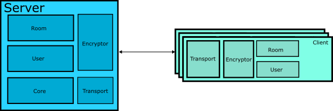

Submarine Designdoc
===================

* [Overview](#overview)
* [Goal](#goal)
   * [System Architecture](#system-architecture)

Overview
========
Secure communication, no outer systems able to know messages that be transfered between communicators, is very important for privacy. The project is expected to provide a software which gurantee that paths between you and another end is totally encrypted.

Goal 
======
* All messages of paths between communicators are encrypted.
* Support unitcast 
* Support multicast (Group Chat)
* Support broadcast (Manager to broadcast message to all users)
* Support text, images, videos

System Architecture
===================

Design
======

## Server
As the figure showed in [System Architecture](#system-architecture), Server-side has 6 components:

* Room 
* User 
* Core
* Encryptor
* Transport

All of these components work together to achieve our gloas that listed in [Goal](#goal). 

User Component and Room components offer **Data Structures** and **Interfaces** to do several types of message casting. More detailed in [User and Rooms](./UserAndRoom.md).

Core offer basic functionality about network related works, message request and etc.

Encryptor and Transport's responsibilities are encrypt and transfer messages or receive and decrypt messages.

