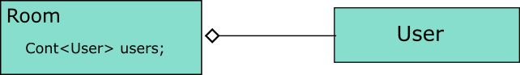

Users and Rooms
===============
Room allow user to create a subset of all users that they want to communicate with. Users within a Room are able to broadcasting messages to another users within the same Room.

Goal
====
* Room can seperate messages between users within and outside of it.
* At least two roles exists in a room, Admin and Normal.
* Flow control in two granularity:
  * Room-level
  * User-level

Design
======

