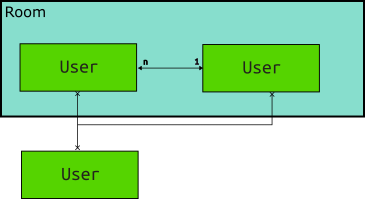

Users and Rooms
===============

Room allow user to create a subset of all users that they want to communicate with. Users within a Room are able to broadcasting messages to another users within the same Room.

**Data Structures** currently used to support these concepts are really simple, support massive of users is not our goal so just keep it simple.

